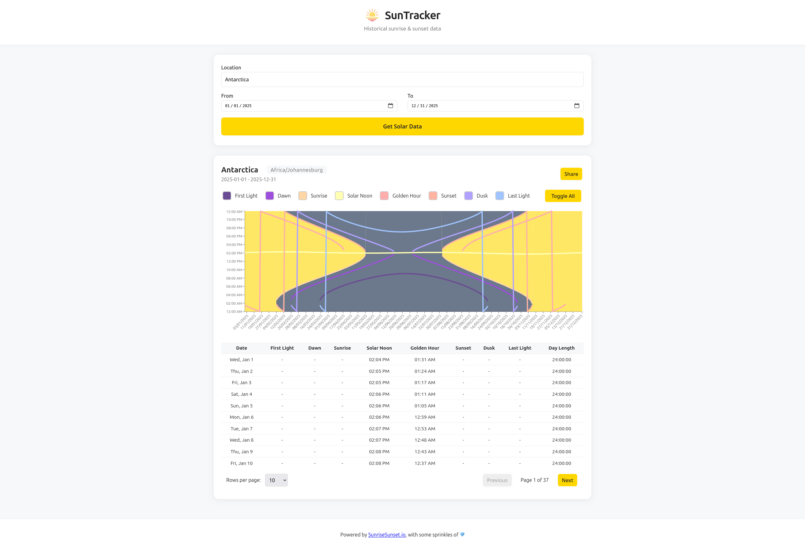

# SunTracker

Sun Tracker is a full-stack application for tracking sunrise and sunset events based on geolocation. It consists of a Ruby on Rails backend API and a React frontend powered by Vite. The backend manages event data and provides geocoding and sun time calculations, while the frontend offers a modern UI for interacting with the data. Watch the video demo [here](https://www.youtube.com/watch?v=36XgDDjD8Zs).



## Features
- Track sunrise and sunset events for any location
- Geocoding service to convert addresses to coordinates
- Interactive charts and tables for event visualization
- Shareable event data
- RESTful API (Rails)
- Modern, fast frontend (React + Vite)

---

## Backend Setup (Ruby on Rails)

### Prerequisites
- Ruby (see `.ruby-version` for required version)
- Rails (see `Gemfile`)
- SQLite (or your preferred DB)
- Docker (optional, for containerized setup)

### Installation
1. **Install dependencies:**
   ```bash
   cd backend
   bundle install
   ```
2. **Set up the database:**
   ```bash
   rails db:create db:migrate db:seed
   ```

### Running the Backend
- **Locally:**
  ```bash
  rails server
  ```

### API Endpoints
- Main endpoints are under `/api/v1/events` (see `app/controllers/v1/events_controller.rb`)

---

## Frontend Setup (React + Vite)

### Prerequisites
- Node.js (see `package.json` for version)
- pnpm (recommended, see `pnpm-lock.yaml`)

### Installation
1. **Install dependencies:**
   ```bash
   cd frontend
   pnpm install
   ```
2. **Environment variables:**
   - Copy `.env.development` to `.env` and adjust as needed.
   - Set API endpoint, e.g.:
     ```env
     VITE_API_URL=http://localhost:3000
     ```

### Running the Frontend
- **Development mode:**
  ```bash
  pnpm dev
  ```
- **Production build:**
  ```bash
  pnpm build
  pnpm preview
  ```

---

## Testing

### Backend
- Run Rails tests:
  ```bash
  rails test
  ```

---

## Troubleshooting & FAQ

- **Backend fails to start?**
  - Check Ruby and Rails versions
- **Frontend cannot reach API?**
  - Check `VITE_API_URL` in `.env` or `.env.development`

